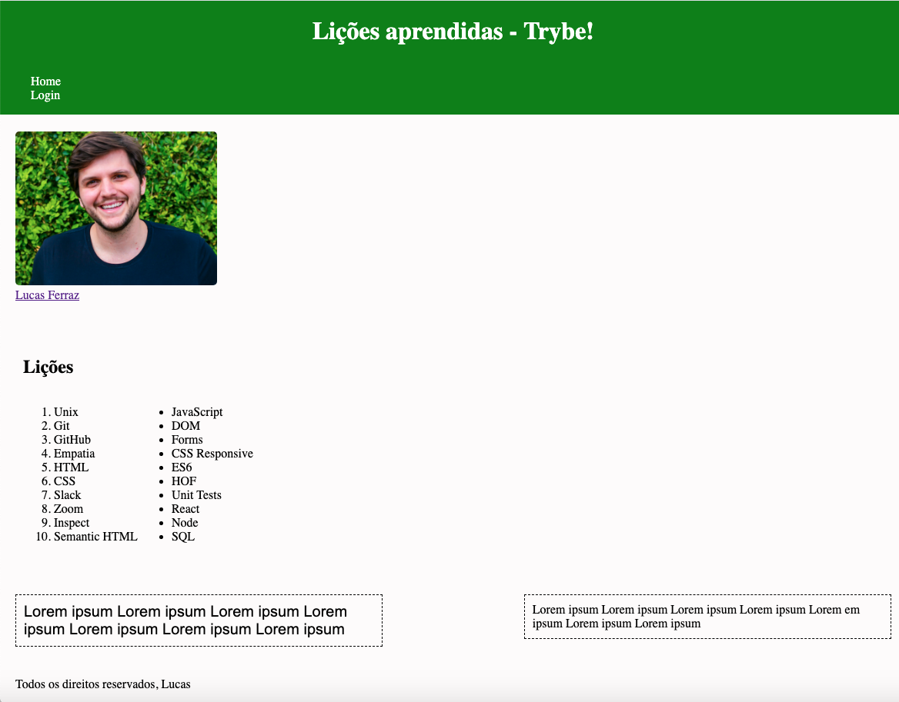

### Termos e acordos

Ao iniciar este projeto, você concorda com as diretrizes do Código de Ética e Conduta e do Manual da Pessoa Estudante da Trybe.

# Boas vindas ao repositório do projeto Lições Aprendidas!

Você já usa o GitHub diariamente para desenvolver os exercícios, certo? Agora, para desenvolver os projetos, você deverá seguir as instruções a seguir. Atenção a cada passo e, se tiver qualquer dúvida, nos envie por _Slack_! #vqv 🚀

Aqui você vai encontrar os detalhes de como estruturar o desenvolvimento do seu projeto a partir deste repositório, utilizando uma branch específica e um _Pull Request_ para colocar seus códigos.

---

## SUMÁRIO

- [Habilidades](#habilidades)
- [Entregáveis](#entregáveis)
  - [O que deverá ser desenvolvido](#o-que-deverá-ser-desenvolvido)
  - [Desenvolvimento](#desenvolvimento)
  - [Data de entrega](#data-de-entrega)
- [Instruções para entregar seu projeto](#instruções-para-entregar-seu-projeto)
  - [Antes de começar a desenvolver](#antes-de-começar-a-desenvolver)
  - [Durante o desenvolvimento](#durante-o-desenvolvimento)
- [Como desenvolver](#como-desenvolver)
  - [Linter](#linter)
  - [Avaliador Automático](#avaliador-automático)
- [Requisitos](#requisitos)
  - [Dicas](#dicas)
  - [Lista de requisitos](#lista-de-requisitos)
    - [1. Adicione uma cor de fundo específica para a página](#1-adicione-uma-cor-de-fundo-específica-para-a-página)
    - [2. Adicione uma barra superior com um título](#2-adicione-uma-barra-superior-com-um-título)
    - [3. Adicione uma foto sua à página](#3-adicione-uma-foto-sua-à-página)
    - [4. Adicione uma lista de lições aprendidas à página](#4-adicione-uma-lista-de-lições-aprendidas-à-página)
    - [5. Crie uma lista de lições que ainda deseja aprender para a página](#5-crie-uma-lista-de-lições-que-ainda-deseja-aprender-para-a-página)
    - [6. Adicione um rodapé para a página](#6-adicione-um-rodapé-para-a-página)
    - [7. Insira pelo menos um link externo na página](#7-insira-pelo-menos-um-link-externo-na-página)
    - [8. Crie um artigo sobre seu aprendizado](#8-crie-um-artigo-sobre-seu-aprendizado)
    - [9. Crie uma seção que conta uma passagem sobre seu aprendizado](#9-crie-uma-seção-que-conta-uma-passagem-sobre-seu-aprendizado)
    - [10. Aplique elementos HTML de acordo com o sentido e propósito de cada um deles](#10-aplique-elementos-html-de-acordo-com-o-sentido-e-propósito-de-cada-um-deles)
  - [Bônus](#bônus)
    - [11. Teste a semântica da sua página está aprovada pelo site CodeSniffer](#11-teste-a-semântica-da-sua-página-está-aprovada-pelo-site-codesniffer)
    - [12. Adicione uma tabela à página](#12-adicione-uma-tabela-à-página)
    - [13. Utilize o Box model](#13-utilize-o-box-model)
    - [14. Altere atributos relacionados as fontes](#14-altere-atributos-relacionados-as-fontes)
    - [15. Posicione o seu artigo e a seção sobre aprendizados um ao lado do outro](#15-posicione-o-seu-artigo-e-a-seção-sobre-aprendizados-um-ao-lado-do-outro)
- [Depois de terminar o desenvolvimento](#depois-de-terminar-o-desenvolvimento)
- [Revisando um pull request](#revisando-um-pull-request)
- [Avisos Finais](#avisos-finais)


## Habilidades

Neste projeto, você será capaz de:

* Utilizar _HTML_ para construir páginas WEB.
* Utilizar _HTML_ semântico para tornar sua página mais acessível e melhor ranqueada.
* Utilizar _CSS_ para adicionar estilo e posicionar elementos.

---

## Entregáveis

Para entregar o seu projeto você deverá criar um Pull Request neste repositório.

Lembre-se que você pode consultar nosso conteúdo sobre
[Git & GitHub](https://app.betrybe.com/course/fundamentals/git-github-e-internet/git-github-o-que-e-e-para-que-serve/82dcab41-249a-4738-8920-f0eb2cb91d1c/dinamica-de-controle-de-versao/4cbb1980-92f0-4663-9121-dbc0f8d207a7?use_case=calendar) sempre que precisar!

---

## O que deverá ser desenvolvido

Você vai desenvolver um site que contenha uma série de informações sobre o que você aprendeu aqui na Trybe ao longo dos últimos três blocos. Seu site deverá estar com elementos posicionados e estilizados e além disto, deverá conter semântica apropriada para que seja acessível e melhor ranqueado.

💡Veja o exemplo a seguir de como o projeto pode se parecer depois de pronto. Lembre-se que você pode ~~e deve~~ ir além para deixar o projeto com a sua cara e impressionar todas as pessoas!

<!--  -->

## Desenvolvimento

Você deve desenvolver uma página HTML estilizada com CSS.

Através desta aplicação, será possível realizar a construção de código HTML, posicionamento e estilização CSS.

## Data de Entrega

  - Será `1` dia de projeto.
  - Data de entrega para avaliação final do projeto: `08/02/2022 - 14:00h`.

---

## Instruções para  entregar seu projeto

### Antes de começar a desenvolver

1. Clone o repositório
  * `git clone git@github.com:tryber/sd-020-b-project-lessons-learned.git`
  * Entre na pasta do repositório que você acabou de clonar:
    * `cd sd-020-b-project-lessons-learned`
    * **Lembre-se de não executar `git init` nesta pasta 😉**

2. Instale as dependências e inicialize o projeto
  * Instale as dependências:
    * `npm install`

2. Crie uma branch a partir da branch `master`
  * Verifique que você está na branch `master`
    * Exemplo: `git branch`
  * Se não estiver, mude para a branch `master`
    * Exemplo: `git checkout master`
  * Agora, crie uma branch onde você vai guardar os `commits` do seu projeto
    * Você deve criar uma branch no seguinte formato: `nome-sobrenome-nome-do-projeto`
    * Exemplo: `git checkout -b maria-soares-lessons-learned`

3. Crie na raiz do projeto os arquivos que você precisará desenvolver:
  * Verifique que você está na raiz do projeto
    * Exemplo: `pwd` -> o retorno vai ser algo tipo _/Users/maria/code/**sd-020-b-project-lessons-learned**_
  * Crie os arquivos index.html e style.css
    * Exemplo: `touch index.html style.css`

4. Adicione as mudanças ao _stage_ do Git e faça um `commit`
  * Verifique que as mudanças ainda não estão no _stage_
    * Exemplo: `git status` (devem aparecer listados os novos arquivos em vermelho)
  * Adicione o novo arquivo ao _stage_ do Git
      * Exemplo:
        * `git add .` (adicionando todas as mudanças - _que estavam em vermelho_ - ao stage do Git)
        * `git status` (devem aparecer listados os arquivos em verde)
  * Faça o `commit` inicial
      * Exemplo:
        * `git commit -m 'iniciando o projeto. VAMOS COM TUDO :rocket:'` (fazendo o primeiro commit)
        * `git status` (deve aparecer uma mensagem tipo _nothing to commit_ )

5. Adicione a sua branch com o novo `commit` ao repositório remoto
  * Usando o exemplo anterior: `git push -u origin maria-soares-lessons-learned`

6. Crie um novo `Pull Request` _(PR)_
  * Vá até a página de _Pull Requests_ do [repositório no GitHub](https://github.com/tryber/sd-020-b-project-lessons-learned/pulls)
  * Clique no botão verde _"New pull request"_
  * Clique na caixa de seleção _"Compare"_ e escolha a sua branch **com atenção**
  * Clique no botão verde _"Create pull request"_
  * Adicione uma descrição para o _Pull Request_, um título claro que o identifique, e clique no botão verde _"Create pull request"_
  * **Não se preocupe em preencher mais nada por enquanto!**
  * Volte até a [página de _Pull Requests_ do repositório](https://github.com/tryber/sd-020-b-project-lessons-learned/pulls) e confira que o seu _Pull Request_ está criado

--- 

### Durante o desenvolvimento

* Faça `commits` das alterações que você fizer no código regularmente

* Lembre-se de sempre após um (ou alguns) `commits` atualizar o repositório remoto

* Os comandos que você utilizará com mais frequência são:
  1. `git status` _(para verificar o que está em vermelho - fora do stage - e o que está em verde - no stage)_
  2. `git add` _(para adicionar arquivos ao stage do Git)_
  3. `git commit` _(para criar um commit com os arquivos que estão no stage do Git)_
  5. `git push -u nome-da-branch` _(para enviar o commit para o repositório remoto na primeira vez que fizer o `push` de uma nova branch)_
  4. `git push` _(para enviar o commit para o repositório remoto após o passo anterior)_

---

## Como desenvolver

### Linter

Para garantir a qualidade do seu código de forma a tê-lo mais legível, de mais fácil manutenção e seguindo as boas práticas de desenvolvimento nós utilizamos neste projeto o linter `ESLint`. Para rodar o linter localmente no seu projeto, execute o comando abaixo:

```bash
npm run lint:styles
```

⚠ **NESTE PROJETO O STYLELINT NÃO SERÁ AVALIADO. VOCÊ PODE RODAR O TESTE LOCALMENTE E FAZER AS CORREÇÕES SE DESEJAR!** ⚠

Após clonar o projeto, você deverá criar os arquivos **index.html** e **style.css** que conterão seu código HTML e CSS, respectivamente. Observe que seus arquivos **devem** possuir estes nomes para que seu projeto seja testado corretamente pelo avaliador automático.

Você é livre para adicionar outros arquivos se julgar necessário. Qualquer dúvida, procure a Pessoa Instrutora que te acompanha.

Lembre-se que sua página deverá conter semântica adequada e para isso verifique se sua página está aprovada no [CodeSniffer](https://squizlabs.github.io/HTML_CodeSniffer/).


### Avaliador automático

* Os requisitos do seu projeto são avaliados automaticamente, sendo utilizada a resolução de tela de `1366 x 768` (1366 pixels de largura por 768 pixels de altura).

* ⚠️ Recomenda-se desenvolver seu projeto usando a mesma resolução, via instalação [deste plugin](https://chrome.google.com/webstore/detail/window-resizer/kkelicaakdanhinjdeammmilcgefonfh?hl=en) do `Chrome` para facilitar a configuração da resolução. ⚠️

* Atente-se para o tamanho das imagens que você utilizará neste projeto. **Não utilize imagens com um tamanho maior que _500Kb_.**

* ⚠️ Utilize uma ferramenta [como esta](https://picresize.com/pt) para redimensionar as imagens. ⚠️

* Caso a avaliação falhe com alguma mensagem de erro parecida com `[409:0326/130838.878602:FATAL:memory.cc(22)] Out of memory. size=4194304`, provavelmente as imagens que você está utilizando estão muito grandes. Tente redimensiona-las para um tamanho menor.

Para verificar se a sua avaliação foi computada com sucesso, você pode verificar os **detalhes da execução do avaliador**.

* Na página do seu _Pull Request_, acima do "botão de merge", procure por _**"Evaluator job"**_ e clique no link _**"Details"**_;

* Na página que se abrirá, procure pela linha _**"Cypress evaluator step"**_ e clique nela;

* Analise os resultados a partir da mensagem _**"(Run Starting)"**_;

* Caso tenha dúvidas, consulte [este vídeo](https://vimeo.com/420861252) ou procure as pessoas instrutoras.

Para rodar o avaliador automático localmente no seu projeto, execute um dos comandos abaixo:

```bash
npm test
```

***ou***

```bash
npm run cypress:open
```

Após executar o comando acima, será aberta uma janela de navegador e então basta clicar no nome do arquivo de teste que quiser executar (*project.spec.js*, ou *bonus.spec.js*), ou para executar todos os testes clique em *Run 2 integration specs*

Você tem liberdade para adicionar novos comportamentos ao seu projeto, seja na forma de aperfeiçoamentos em requisitos propostos ou novas funcionalidades, **desde que tais comportamentos adicionais não conflitem com os requisitos propostos**.

* Você pode fazer mais do que for pedido, mas nunca menos.

* **Nada além do que for pedido nos requisitos será avaliado**. _Esta é uma oportunidade de você exercitar sua criatividade e experimentar com os conhecimentos adquiridos._

---

## Requisitos

### Dicas

Para fazer este projeto você deverá atribuir a barra superior o `position: fixed;`. Leia mais sobre ele [aqui](https://www.w3schools.com/css/css_positioning.asp).

Para colocar sua página no [GitHub Pages](https://pages.github.com/), não é necessário remover o conteúdo que já está lá, você pode apenas adicionar essa nova página. Para isso, todo o conteúdo desse projeto deve ser colocado em uma pasta `/projetos/lessons-learned`.

### Lista de requisitos

⚠️ Leia-os atentamente e siga à risca o que for pedido. Em particular, **atente-se para os nomes de _ids_ que alguns elementos de seu projeto devem possuir**. ⚠️

O não cumprimento de um requisito, total ou parcialmente, impactará em sua avaliação.

---

### 👀Observações importantes:

* Lembrem-se que como pessoas desenvolvedoras devemos fazer pesquisas e garimpar resultados para auxiliar no entendimento do assunto. Assim, para solucionar os requisitos do projeto é inevitável e estimulado que pesquisas sejam feitas nas mais variadas fontes (course, vídeos do course, google, youtube, etc) sempre tomando cuidado para utilizar fontes "confiáveis" nas pesquisas da Internet, como por exemplo:
  
  * [Javascript.com](http://javascript.com/)
  
  * [W3Schools](https://www.w3schools.com/js/default.asp)
  
  * [MDN](https://developer.mozilla.org/pt-BR/docs/Web/JavaScript)
  
  * [StackOverflow](https://pt.stackoverflow.com/questions/tagged/javascript)
  

### 1. Adicione uma cor de fundo específica para a página

Possuir cor de fundo: rgb(253, 251, 251)

**O que será verificado:**

- Possuir cor de fundo: rgb(253, 251, 251)

### 2. Adicione uma barra superior com um título

A barra deve possuir o ID "cabecalho" e deve ser fixa no topo da página com a propriedade top tendo **0**. O título deve estar dentro da barra e ser um elemento **h1** com ID "titulo".

**O que será verificado:**

- A barra possui o ID "cabecalho"
- A barra superior deve ser fixa no topo da página, com a propriedade top tendo o valor `0`
- O título deve estar dentro da barra e possuir o ID "titulo", além de ser uma tag "h1"

### 3. Adicione uma foto sua à página

A foto deve ser inserida utilizando uma tag **img** com o ID "minha_foto".

**O que será verificado:**

- A foto deve ser inserida utilizando uma tag img com o ID "minha_foto"

### 4. Adicione uma lista de lições aprendidas à página

A lista deve possuir **10** itens, ser numerada e possuir o ID "licoes_aprendidas".

**O que será verificado:**

- A lista deve ser numerada e possuir o ID "licoes_aprendidas"
- A lista deve possuir 10 itens

### 5. Crie uma lista de lições que ainda deseja aprender para a página

A lista deve possuir **10** itens, não ser numerada e possuir o ID "licoes_a_aprender".

**O que será verificado:**

- A lista não deve ser numerada e deve possuir o ID "licoes_a_aprender"
- A lista deve possuir 10 itens

### 6. Adicione um rodapé para a página

O rodapé deve utilizar a tag **footer** e possuir o ID "rodape".

**O que será verificado:**

- O rodapé deve possuir o ID "rodape"

### 7. Insira pelo menos um link externo na página

A configuração desse link deve ser feita para abrir em uma nova aba do navegador

**O que será verificado:**

- A configuração desse link deve ser feita para abrir em uma nova aba do navegador

### 8. Crie um artigo sobre seu aprendizado

O artigo deverá possuir mais de 300 **caracteres** e menos de 600, além disto deve possuir a tag **article**.

**O que será verificado:**

- A `tag` `article` devem ser utilizadas
- O artigo deve ter mais de 300 caracteres e menos de 600

### 9. Crie uma seção que conta uma passagem sobre seu aprendizado

A seção deverá possuir mais de 100 **caracteres** e menos de 300, além disto deve possuir a tag **aside**.

**O que será verificado:**

- A `tag` `aside` deve ser utilizada
- A seção deve ter mais que 100 caracteres e menos que 300

### 10. Aplique elementos HTML de acordo com o sentido e propósito de cada um deles

Para tornar o seu site mais acessível e melhorar seu ranqueamento em mecanismos de busca na Web, sua página deve conter os seguintes elementos: article, header, nav, section, aside e footer.

**O que será verificado:**

- Validar se a página possui um elemento "article"
- Validar se a página possui um elemento "header"
- Validar se a página possui um elemento "nav"
- Validar se a página possui um elemento "section"
- Validar se a página possui um elemento "aside"
- Validar se a página possui um elemento "footer"

### 11. Teste a semântica da sua página está aprovada pelo site CodeSniffer

Teste a semântica da sua página está aprovada pelo site CodeSniffer

**O que será verificado:**

- Seu site deve passar sem problemas na verificação de semântica do site CodeSniffer

### BÔNUS

### 12. Adicione uma tabela à página

**O que será verificado:**

- A página deve possuir uma tabela

### 13. Utilize o Box model

Altere **margin**, **padding** e **border** dos elementos para ver, na prática, como esses atributos influenciam e melhoram a visualização dos componentes.

**O que será verificado:**

- Altere `margin`, `padding` e `border` dos elementos para ver, na prática, como esses atributos influenciam e melhoram a visualização dos componentes

### 14. Altere atributos relacionados as fontes
Modifique o estilo da sua tipografia alterando o tamanho de letra, a cor, o espaçamento entre as linhas e a **font-family**.

**O que será verificado:**

- Altere o tamanho da letra
- Altere a cor da letra
- Altere o espaçamento entre as linhas
- Altere o `font-family`

### 15. Posicione o seu artigo e a seção sobre aprendizados um ao lado do outro

Adicione ao elemento posicionado no lado esquerdo a classe "lado-esquerdo" e ao elemento posicionado no lado direito a classe "lado-direito"

**O que será verificado:**

- Utilizar a classe "lado-esquerdo"
- Utilizar a classe "lado-direito"
- Verificar se os elementos com as classes lado-direito e lado-esquerdo estão posicionados corretamente

---

### (OPCIONAL) Depois de terminar o desenvolvimento

* Vá até a página **DO SEU** _Pull Request_, adicione a label de _"code-review"_ e marque seus colegas
  * No menu à direita, clique no _link_ **"Labels"** e escolha a _label_ **code-review**
  * No menu à direita, clique no _link_ **"Assignees"** e escolha **o seu usuário**
  * No menu à direita, clique no _link_ **"Reviewers"** e digite `students`, selecione o time `tryber/students-sd-x`

Se ainda houver alguma dúvida sobre como entregar seu projeto, [aqui tem um video explicativo](https://vimeo.com/362189205).

---

## Avisos finais

Ao finalizar e submeter o projeto, não se esqueça de avaliar sua experiência preenchendo o formulário. Leva menos de 3 minutos!

Link: [FORMULÁRIO DE AVALIAÇÃO DE PROJETO](https://be-trybe.typeform.com/to/ZTeR4IbH)

O avaliador automático não necessariamente avalia seu projeto na ordem em que os requisitos aparecem no readme. Isso acontece para deixar o processo de avaliação mais rápido. 😉

---
